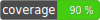

# Tinkoff Invest V1 common component

This component is common set of models that used across tinkoff invest api.

Consist of:
- MoneyValue model
- Quotation model
- MoneyValue model factory - MoneyValueFactory
- Quotation model factory - QuotationFactory

Component dependencies:
- arslanimamutdinov/iso-standard-4217 (https://github.com/arslanim/iso-standard-4217) - for currency ISO standard implementation

## Contributing

Welcome to pull requests. If there is a major changes, first please open an issue for discussion.

Please make sure to update tests as appropriate.

